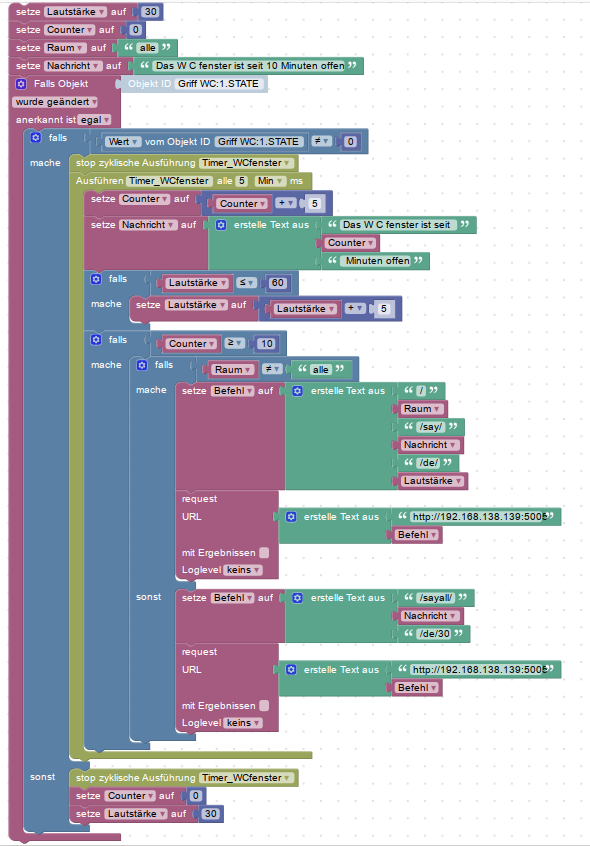

# iobroker.sonos_api
How to Use the sonos API

Nach Vorarbeit des Users skokarl im ioBroker-Forum

https://forum.iobroker.net/topic/22888/gel%C3%B6st-sonos-http-api-installation-f%C3%BCr-newbies-dummies-und-mich

---

## Installation

Mit Putty auf dem der Konsole vom ioBroker Server Broker einloggen
und folgende Befehle der Reihe nach eingeben


```
wget https://github.com/jishi/node-sonos-http-api/archive/master.zip
unzip master.zip
cd node-sonos-http-api-master
npm install --production
```
---
## Test der API auf Funktion
### Start des Servers

```
npm start
```
Putty erst einmal offen lassen !!

### Erster Test

Aufruf der IP des ioBroker Servers mit Port 5005

http://192.168.xxx.xxx:5005/

In Putty tauchen jetzt zwei Meldungen auf, diese erst einmal ignorieren.

1.) settings.json wird nicht gefunden ( ignorieren )
Wenn keine settings.json gefunden wird, wird die default Einstellung genommen.
In den Settings könnten spezielle Einstellungen verändert werden, wie z.B der Port 5005

2.) http server listening on 0.0.0.0
Der Server lauscht also an allen IPs

---
## Einfügen in den Autostart
```
sudo nano /etc/systemd/system/sonosapi.service
```

Dazu eine Datei `sonosapi.service` mit folgendem Inhalt anlegen

```
[Unit]
Description=Sonos HTTP API Daemon
After=syslog.target network.target

[Service]
Type=simple
ExecStart=/usr/bin/node /home/$user$/node-sonos-http-api-master/server.js
Restart=always
RestartSec=10

[Install]
WantedBy=multi-user.target
```

Den Pfad zu server.js bitte anpassen!

Anschließend den Service starten mit `sudo systemctl enable sonosapi.service`
Danach einen reboot aus führen mit `sudo reboot`

---
## Änderungen an der SONOS Infrastruktur
Sobald NACH der Installation der API Änderungen an der Infrastruktur des SONOS-Systems durchegführt werden, wie
* Änderung(en) der IPAdressen der Lautsprecher
* Hinzufügen neuer Lautsprecher
ist zwingend ein Neustart des Services wie folgt notwendig

```
sudo systemctl stop sonosapi.service
sudo systemctl start sonosapi.service
```

Ein kompletter Reboot des ioBroker-Servers erfüllt dies auch, ist aber nicht zwingend notwendig.

---

## TTS-Befehle
Man kann verschiedene Sprachen und Stimmen, sowie verschiedene TTS-Engines verwenden:

* voicerss
* Microsoft Cognitive Services (Bing Text to Speech API)
* AWS Polly
* Google (default)
* macOS say command

Bei den meisten ist eine Anmeldung und ein Key notwendig, Google ist ohne API-Key zu nutzen.

Der Aufruf eines TTS über Google läuft wie folgt:

```
/[Room name]/say/[phrase][/[language_code]][/[announce volume]]
/sayall/[phrase][/[language_code]][/[announce volume]]
```

[Room Name] ist der Name eines in dem Sonos-Controller vergebenen Lautsprechers
[phrase] ist der zu sprechende Text
[language_code] ist die gewünschte Sprache, im deutschsprachiegen Raum also `de`
[announce volume] ist die gewünschte Lautstärke. 

---

### Beispiel: Fenster offen-Meldung
Die wohl häufigste Anwendung für eine TTS-Aktion ist der Wunsch zu wissen, wenn ein Fenster nach längerer Zeit vergessen wurde zu schließen, gerade in der kalten Jahreszeit.

Das folgende Beispiel zeigt ein etwas umfangreicheres Blockly, in dem mehrere Variablen verwendet werden, um das Blockly leicht an andere Anwendungen anzupassen.

Hier wird nach dem Öffnen des Fensters ein Timer gestartet, der sich alle 5 Minuten erhöht.
Nach 10 Minuten gibt es auf allen SONOS-LAutsprechern die erste Meldung.
Jede  5 Minuten wird diese mit erhöhter Lautstärke wiederholt, bis das Fenster wieder geschlossen ist:



und hier als Import

<details>
  
```
<xml xmlns="http://www.w3.org/1999/xhtml">
  <variables>
    <variable type="" id="@^s0bK9fM:FXZwSl7)^N">Lautstärke</variable>
    <variable type="" id="6:s1Zo4W5}f483}-qH}T">Counter</variable>
    <variable type="" id="SFwS`:dt]EDO$hdjaz:5">Raum</variable>
    <variable type="" id="gvn.@ec[1RiFVpP7PX{a">Nachricht</variable>
    <variable type="undefined" id="Timer_WCfenster">Timer_WCfenster</variable>
    <variable type="" id="1T#Gu#s8/SO!EIx[Q,9=">Befehl</variable>
  </variables>
  <block type="variables_set" id="q{;[qF4pxCOp@7|.kUM4" x="188" y="-487">
    <field name="VAR" id="@^s0bK9fM:FXZwSl7)^N" variabletype="">Lautstärke</field>
    <value name="VALUE">
      <block type="math_number" id="gSS+(#*mDEN:JgfL@`wz">
        <field name="NUM">30</field>
      </block>
    </value>
    <next>
      <block type="variables_set" id="S@vH848L$j=0ywb)[}fP">
        <field name="VAR" id="6:s1Zo4W5}f483}-qH}T" variabletype="">Counter</field>
        <value name="VALUE">
          <block type="math_number" id="_Va5N^VM3I|Bxz@}*7Qh">
            <field name="NUM">0</field>
          </block>
        </value>
        <next>
          <block type="variables_set" id="i0(fyj`ojuMM~w/sIJkm">
            <field name="VAR" id="SFwS`:dt]EDO$hdjaz:5" variabletype="">Raum</field>
            <value name="VALUE">
              <block type="text" id="*|*o=(NTCaGIUc5L}M#@">
                <field name="TEXT">alle</field>
              </block>
            </value>
            <next>
              <block type="variables_set" id="Brv7I`#{[,Y4b:iq=cP8">
                <field name="VAR" id="gvn.@ec[1RiFVpP7PX{a" variabletype="">Nachricht</field>
                <value name="VALUE">
                  <block type="text" id="FO#/mWcmHx42?Q^{BvgR">
                    <field name="TEXT">Das W C fenster ist seit 10 Minuten offen</field>
                  </block>
                </value>
                <next>
                  <block type="on_ext" id="*$F$h%MF@=voV_mnHxLk">
                    <mutation items="1"></mutation>
                    <field name="CONDITION">ne</field>
                    <field name="ACK_CONDITION"></field>
                    <value name="OID0">
                      <shadow type="field_oid" id="ULPFV!EFYivh/tGiULG*">
                        <field name="oid">hm-rpc.0.JRT0001400.1.STATE</field>
                      </shadow>
                    </value>
                    <statement name="STATEMENT">
                      <block type="controls_if" id="y)yHf/q-?:(j/Q*dwe(c">
                        <mutation else="1"></mutation>
                        <value name="IF0">
                          <block type="logic_compare" id="t#/rRBq=7!Wd%Jxns8/@">
                            <field name="OP">NEQ</field>
                            <value name="A">
                              <block type="get_value" id="0l;1(ei`iKBK]5-zRb^t">
                                <field name="ATTR">val</field>
                                <field name="OID">hm-rpc.0.JRT0001400.1.STATE</field>
                              </block>
                            </value>
                            <value name="B">
                              <block type="math_number" id="YY:g3hS.)6Gh+45Dtk7i">
                                <field name="NUM">0</field>
                              </block>
                            </value>
                          </block>
                        </value>
                        <statement name="DO0">
                          <block type="timeouts_clearinterval" id="u{%g}+LYK5ek*DE@NkK[">
                            <field name="NAME">Timer_WCfenster</field>
                            <next>
                              <block type="timeouts_setinterval" id=":nL4Pw_k(Kf.jA!XMj*e">
                                <field name="NAME">Timer_WCfenster</field>
                                <field name="INTERVAL">5</field>
                                <field name="UNIT">min</field>
                                <statement name="STATEMENT">
                                  <block type="variables_set" id="nI?TFBxvyt},^dN$~trc">
                                    <field name="VAR" id="6:s1Zo4W5}f483}-qH}T" variabletype="">Counter</field>
                                    <value name="VALUE">
                                      <block type="math_arithmetic" id="7#RafW+X,_c5JF/8H4?0">
                                        <field name="OP">ADD</field>
                                        <value name="A">
                                          <shadow type="math_number" id="vQ6)nub,ePq`*|,=[w3d">
                                            <field name="NUM">1</field>
                                          </shadow>
                                          <block type="variables_get" id="48jA23v`2Hh)m63coJz`">
                                            <field name="VAR" id="6:s1Zo4W5}f483}-qH}T" variabletype="">Counter</field>
                                          </block>
                                        </value>
                                        <value name="B">
                                          <shadow type="math_number" id="0+mw;mJ@CC9P85FRknk?">
                                            <field name="NUM">5</field>
                                          </shadow>
                                        </value>
                                      </block>
                                    </value>
                                    <next>
                                      <block type="variables_set" id="bl-miA0OUtio8DsmTJlJ">
                                        <field name="VAR" id="gvn.@ec[1RiFVpP7PX{a" variabletype="">Nachricht</field>
                                        <value name="VALUE">
                                          <block type="text_join" id=",LNlctr%P=?(F~taMOB(">
                                            <mutation items="3"></mutation>
                                            <value name="ADD0">
                                              <block type="text" id="XPR^x`{TLs/C},wFickb">
                                                <field name="TEXT">Das W C fenster ist seit </field>
                                              </block>
                                            </value>
                                            <value name="ADD1">
                                              <block type="variables_get" id="Bub#:@(_C=f5ONGMN,Cw">
                                                <field name="VAR" id="6:s1Zo4W5}f483}-qH}T" variabletype="">Counter</field>
                                              </block>
                                            </value>
                                            <value name="ADD2">
                                              <block type="text" id="}K)l#fBVM89E5iZ_,@c(">
                                                <field name="TEXT"> Minuten offen</field>
                                              </block>
                                            </value>
                                          </block>
                                        </value>
                                        <next>
                                          <block type="controls_if" id="z%6f_ZGAAWi2GZ;tS]F^">
                                            <value name="IF0">
                                              <block type="logic_compare" id="ed4uNFC+d$vuk9+Bz8{Q">
                                                <field name="OP">LTE</field>
                                                <value name="A">
                                                  <block type="variables_get" id="z=`wd`.`V$dn,]OuGCTB">
                                                    <field name="VAR" id="@^s0bK9fM:FXZwSl7)^N" variabletype="">Lautstärke</field>
                                                  </block>
                                                </value>
                                                <value name="B">
                                                  <block type="math_number" id="ML*WB=F,YmX0kI0R3@$j">
                                                    <field name="NUM">60</field>
                                                  </block>
                                                </value>
                                              </block>
                                            </value>
                                            <statement name="DO0">
                                              <block type="variables_set" id="J+^IB,P,b-slW,_53*E!">
                                                <field name="VAR" id="@^s0bK9fM:FXZwSl7)^N" variabletype="">Lautstärke</field>
                                                <value name="VALUE">
                                                  <block type="math_arithmetic" id="tCE3ilPo~]j`o){McsHM">
                                                    <field name="OP">ADD</field>
                                                    <value name="A">
                                                      <shadow type="math_number" id="vQ6)nub,ePq`*|,=[w3d">
                                                        <field name="NUM">1</field>
                                                      </shadow>
                                                      <block type="variables_get" id="k=Tp`H/Ej]z#7ri!Um+s">
                                                        <field name="VAR" id="@^s0bK9fM:FXZwSl7)^N" variabletype="">Lautstärke</field>
                                                      </block>
                                                    </value>
                                                    <value name="B">
                                                      <shadow type="math_number" id="u[Z2Wg?hBcgE(XeJ,}Q$">
                                                        <field name="NUM">5</field>
                                                      </shadow>
                                                    </value>
                                                  </block>
                                                </value>
                                              </block>
                                            </statement>
                                            <next>
                                              <block type="controls_if" id="WJ%To+9c;ZktW[())7jO">
                                                <value name="IF0">
                                                  <block type="logic_compare" id="vwm`z6}X~V@*26lwrwVr">
                                                    <field name="OP">GTE</field>
                                                    <value name="A">
                                                      <block type="variables_get" id="-5+3oGu4pl?38R-F[LfN">
                                                        <field name="VAR" id="6:s1Zo4W5}f483}-qH}T" variabletype="">Counter</field>
                                                      </block>
                                                    </value>
                                                    <value name="B">
                                                      <block type="math_number" id="g|d,H)lbq.wa:O,MH=7+">
                                                        <field name="NUM">10</field>
                                                      </block>
                                                    </value>
                                                  </block>
                                                </value>
                                                <statement name="DO0">
                                                  <block type="controls_if" id="./Q3|;`OS9W])ALp^fdI">
                                                    <mutation else="1"></mutation>
                                                    <value name="IF0">
                                                      <block type="logic_compare" id="ITuPw}=|f)$EWGU!Sg$,">
                                                        <field name="OP">NEQ</field>
                                                        <value name="A">
                                                          <block type="variables_get" id="p~h16t!@6@;q!:$yW[0d">
                                                            <field name="VAR" id="SFwS`:dt]EDO$hdjaz:5" variabletype="">Raum</field>
                                                          </block>
                                                        </value>
                                                        <value name="B">
                                                          <block type="text" id="8}+n8~;*F;L+lPjbr^7m">
                                                            <field name="TEXT">alle</field>
                                                          </block>
                                                        </value>
                                                      </block>
                                                    </value>
                                                    <statement name="DO0">
                                                      <block type="variables_set" id="BY?T;$TYb4fbmeVO+/0S">
                                                        <field name="VAR" id="1T#Gu#s8/SO!EIx[Q,9=" variabletype="">Befehl</field>
                                                        <value name="VALUE">
                                                          <block type="text_join" id="z5T4qmW(ZsjWY?S}ow+$">
                                                            <mutation items="6"></mutation>
                                                            <value name="ADD0">
                                                              <block type="text" id="ms:NU#}0J[8+s/sJtWP!">
                                                                <field name="TEXT">/</field>
                                                              </block>
                                                            </value>
                                                            <value name="ADD1">
                                                              <block type="variables_get" id="PwsFL.g214Y:]#_2m0LS">
                                                                <field name="VAR" id="SFwS`:dt]EDO$hdjaz:5" variabletype="">Raum</field>
                                                              </block>
                                                            </value>
                                                            <value name="ADD2">
                                                              <block type="text" id="U!#)6,:sZ:tp*kTuuUm[">
                                                                <field name="TEXT">/say/</field>
                                                              </block>
                                                            </value>
                                                            <value name="ADD3">
                                                              <block type="variables_get" id="N!hFsUL6m{E6nnGrgB*7">
                                                                <field name="VAR" id="gvn.@ec[1RiFVpP7PX{a" variabletype="">Nachricht</field>
                                                              </block>
                                                            </value>
                                                            <value name="ADD4">
                                                              <block type="text" id="9B2RQfgdGuW_LI}Ph^d?">
                                                                <field name="TEXT">/de/</field>
                                                              </block>
                                                            </value>
                                                            <value name="ADD5">
                                                              <block type="variables_get" id="PXt*?LD60C[Tf3u4To--">
                                                                <field name="VAR" id="@^s0bK9fM:FXZwSl7)^N" variabletype="">Lautstärke</field>
                                                              </block>
                                                            </value>
                                                          </block>
                                                        </value>
                                                        <next>
                                                          <block type="request" id="%Cmgm;YVCkM@58d4}K;4">
                                                            <mutation with_statement="false"></mutation>
                                                            <field name="WITH_STATEMENT">FALSE</field>
                                                            <field name="LOG"></field>
                                                            <value name="URL">
                                                              <shadow type="text" id="2N%(5gEJVCv/OZJrdq/J">
                                                                <field name="TEXT">text</field>
                                                              </shadow>
                                                              <block type="text_join" id="=q*Bjikt]*c/o/xP@nI@">
                                                                <mutation items="2"></mutation>
                                                                <value name="ADD0">
                                                                  <block type="text" id="O@|Dj(Rx;IRoRvz_mA8(">
                                                                    <field name="TEXT">http://192.168.138.139:5005</field>
                                                                  </block>
                                                                </value>
                                                                <value name="ADD1">
                                                                  <block type="variables_get" id="paI|Y4m|FwdQ@TfX{+Bo">
                                                                    <field name="VAR" id="1T#Gu#s8/SO!EIx[Q,9=" variabletype="">Befehl</field>
                                                                  </block>
                                                                </value>
                                                              </block>
                                                            </value>
                                                          </block>
                                                        </next>
                                                      </block>
                                                    </statement>
                                                    <statement name="ELSE">
                                                      <block type="variables_set" id="zN~7#2;CEU{127GheI_f">
                                                        <field name="VAR" id="1T#Gu#s8/SO!EIx[Q,9=" variabletype="">Befehl</field>
                                                        <value name="VALUE">
                                                          <block type="text_join" id="C_UkCh(Y+fv_pKv2{eCM">
                                                            <mutation items="3"></mutation>
                                                            <value name="ADD0">
                                                              <block type="text" id="d(8r0f+{PO7=s$eKM}Wg">
                                                                <field name="TEXT">/sayall/</field>
                                                              </block>
                                                            </value>
                                                            <value name="ADD1">
                                                              <block type="variables_get" id="6}hNH{l,{yTBgWBmt0{G">
                                                                <field name="VAR" id="gvn.@ec[1RiFVpP7PX{a" variabletype="">Nachricht</field>
                                                              </block>
                                                            </value>
                                                            <value name="ADD2">
                                                              <block type="text" id="G%3cdi;8FXkS{NZR02wD">
                                                                <field name="TEXT">/de/30</field>
                                                              </block>
                                                            </value>
                                                          </block>
                                                        </value>
                                                        <next>
                                                          <block type="request" id="P:YmXs1^!k-@VjUQzZ7_">
                                                            <mutation with_statement="false"></mutation>
                                                            <field name="WITH_STATEMENT">FALSE</field>
                                                            <field name="LOG"></field>
                                                            <value name="URL">
                                                              <shadow type="text" id="2N%(5gEJVCv/OZJrdq/J">
                                                                <field name="TEXT">text</field>
                                                              </shadow>
                                                              <block type="text_join" id="HR]p-G@W%02ew]0]O|q`">
                                                                <mutation items="2"></mutation>
                                                                <value name="ADD0">
                                                                  <block type="text" id="{3a`Yvd8-=s.o9VJTM_Y">
                                                                    <field name="TEXT">http://192.168.138.139:5005</field>
                                                                  </block>
                                                                </value>
                                                                <value name="ADD1">
                                                                  <block type="variables_get" id="`u3^(S@1XgqA,$X1b,df">
                                                                    <field name="VAR" id="1T#Gu#s8/SO!EIx[Q,9=" variabletype="">Befehl</field>
                                                                  </block>
                                                                </value>
                                                              </block>
                                                            </value>
                                                          </block>
                                                        </next>
                                                      </block>
                                                    </statement>
                                                  </block>
                                                </statement>
                                              </block>
                                            </next>
                                          </block>
                                        </next>
                                      </block>
                                    </next>
                                  </block>
                                </statement>
                              </block>
                            </next>
                          </block>
                        </statement>
                        <statement name="ELSE">
                          <block type="timeouts_clearinterval" id=")w1trj_P`?%/lwxMJ#Y8">
                            <field name="NAME">Timer_WCfenster</field>
                            <next>
                              <block type="variables_set" id="cJp$3-cSu~[TzNr]Q;t_">
                                <field name="VAR" id="6:s1Zo4W5}f483}-qH}T" variabletype="">Counter</field>
                                <value name="VALUE">
                                  <block type="math_number" id="U2gP8Q.5g*!RsI2/u0]/">
                                    <field name="NUM">0</field>
                                  </block>
                                </value>
                                <next>
                                  <block type="variables_set" id="3R!t48Fv}706m[2*NWeP">
                                    <field name="VAR" id="@^s0bK9fM:FXZwSl7)^N" variabletype="">Lautstärke</field>
                                    <value name="VALUE">
                                      <block type="math_number" id="3cD`wY@rC{qISaNK7_;`">
                                        <field name="NUM">30</field>
                                      </block>
                                    </value>
                                  </block>
                                </next>
                              </block>
                            </next>
                          </block>
                        </statement>
                      </block>
                    </statement>
                  </block>
                </next>
              </block>
            </next>
          </block>
        </next>
      </block>
    </next>
  </block>
</xml>
```
</details>

## Weitere Funktionen

### Grouping
Diese Funktion bindet zwei (oder mehr) Lautsprecher zu einer Gruppe. Der Befehl `/Kitchen/join/Office` fügt den Lautsprecher "Kitchen" dem Lautsprecher "Office" in einer Gruppe hinzu. Um die Gruppe wieder zu verlassen wird der Befehl `/Kitchen/leave` verwendet oder der Lautsprecher einer anderen Gruppe hinzugefügt.


Die Api enthält jede Menge weitere Funktionen, auf die hier nicht weiter eingegangen wird.

* play
* pause
* playpause (toggles playing state)
* volume (parameter is absolute or relative volume. Prefix +/- indicates relative volume)
* groupVolume (parameter is absolute or relative volume. Prefix +/- indicates relative volume)
* mute / unmute
* groupMute / groupUnmute
* togglemute (toggles mute state)
* trackseek (parameter is queue index)
* timeseek (parameter is in seconds, 60 for 1:00, 120 for 2:00 etc)
* next
* previous
* state (will return a json-representation of the current state of player)
* favorite
* favorites (with optional "detailed" parameter)
* playlist
* lockvolumes / unlockvolumes (experimental, will enforce the volume that was selected when locking!)
* repeat (on/off)
* shuffle (on/off)
* crossfade (on/off)
* pauseall (with optional timeout in minutes)
* resumeall (will resume the ones that was pause on the pauseall call. Useful for doorbell, phone calls, etc. Optional timeout)
* say
* sayall
* saypreset
* queue
* clearqueue
* sleep (values in seconds)
* linein (only analog linein, not PLAYBAR yet)
* clip (announce custom mp3 clip)
* clipall
* clippreset
* join / leave (Grouping actions)
* sub (on/off/gain/crossover/polarity) See SUB section for more info
* nightmode (on/off, PLAYBAR only)
* speechenhancement (on/off, PLAYBAR only)
* bass/treble (use -10 thru 10 as value. 0 is neutral)

Weitere Informationen auf github:
https://github.com/jishi/node-sonos-http-api#usage
